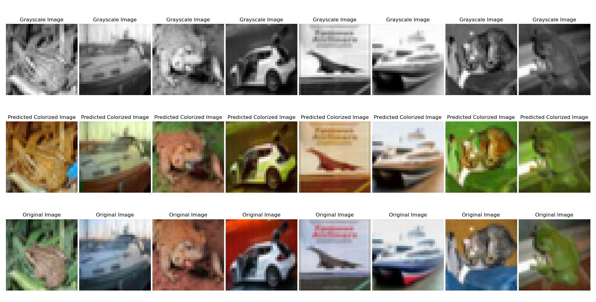
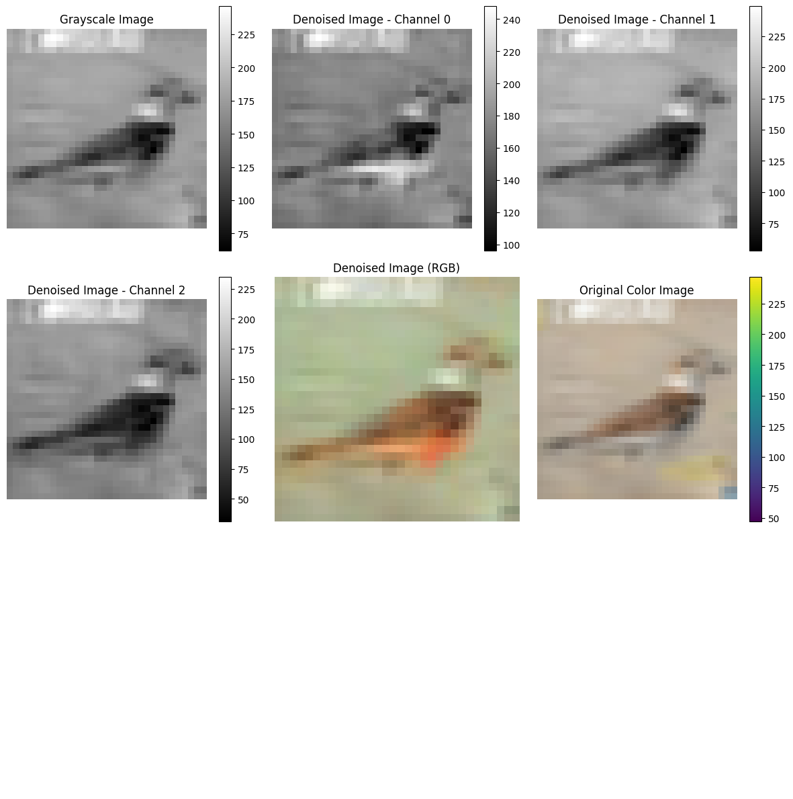
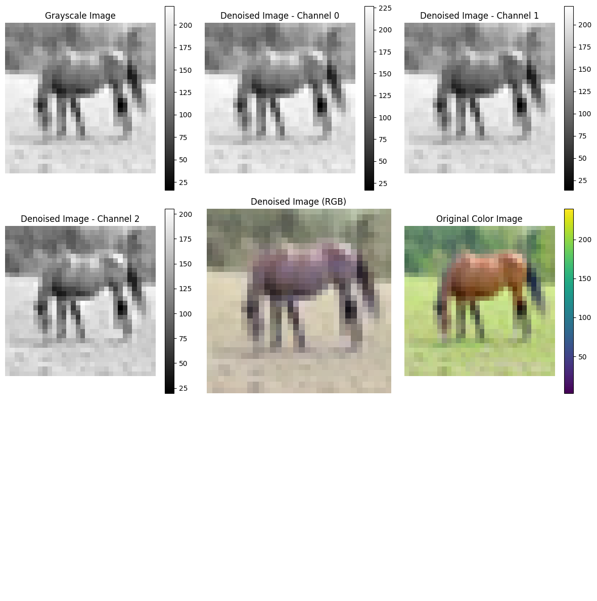

# Image Colorization using Diffusion Models

This repository implements image colorization using a diffusion-based approach inspired by the paper **"Palette:
Image-to-Image Diffusion Models"**. The model is trained to predict the colorized version of grayscale images. Due to
computational constraints, the model has been trained on **32x32** images from the CIFAR-10 dataset.

---

## 📜 Reference

- **Paper**: [Palette: Image-to-Image Diffusion Models](https://arxiv.org/abs/2111.05826)

---

## 🖼️ Dataset

The CIFAR-10 dataset is used for training and evaluation. Images are resized to **32x32** for computational efficiency.

---

## 🚀 Features

- **Diffusion-based Colorization**: Utilizes a diffusion process to progressively denoise grayscale images into
  colorized outputs.
- **Customizable Configurations**: Adjust model architecture, training parameters, and dataset preprocessing via
  configuration files.
- **Efficient Training**: Supports training on smaller image sizes for resource-constrained environments.

---

## 🛠️ Installation

1. Clone the repository:
   ```bash
   git clone https://github.com/your-repo/colorization-diffusion.git
   cd colorization-diffusion
   ```

2. Install dependencies:
   ```bash
   pip install -r requirements.txt
   ```

---

## 🏋️‍♂️ How to Train

To train the model, use the training script:
```bash
python scripts/train_script.py
```

### Training Configuration

The training parameters (batch size, learning rate, etc.) are defined in `configs/config.py`. You can modify them as
needed.

---

## 🧪 How to Run Inference

To perform inference and visualize results:

```bash
python scripts/inference_script.py
```

### Outputs

The script generates and displays:

- Grayscale input images
- Predicted colorized images
- Original ground-truth color images





---

## 📊 Results

Due to training on smaller images (32x32), the results are limited compared to the full implementation in the original
paper. However, this implementation demonstrates the potential of diffusion-based models for image colorization.

---

## 📂 File Structure

```plaintext
├── configs/            # Configuration files
│   └── config.py       # Training and inference parameters
├── data/               # Dataset-related scripts
│   └── dataset.py      # Custom CIFAR-10 dataset with grayscale preprocessing
├── models/             # Model architecture and utilities
│   ├── model.py        # UNet2D model definition
│   └── save_model.py   # Model save/load functions
├── scripts/            # Training and inference scripts
│   ├── train_script.py # Training pipeline
│   └── inference_script.py # Inference pipeline
├── utils/              # Helper functions
│   └── transforms.py   # Preprocessing and reverse transforms
└── requirements.txt    # Python dependencies
```

---

## 📧 Contact

For questions or issues, feel free to open a GitHub issue.
